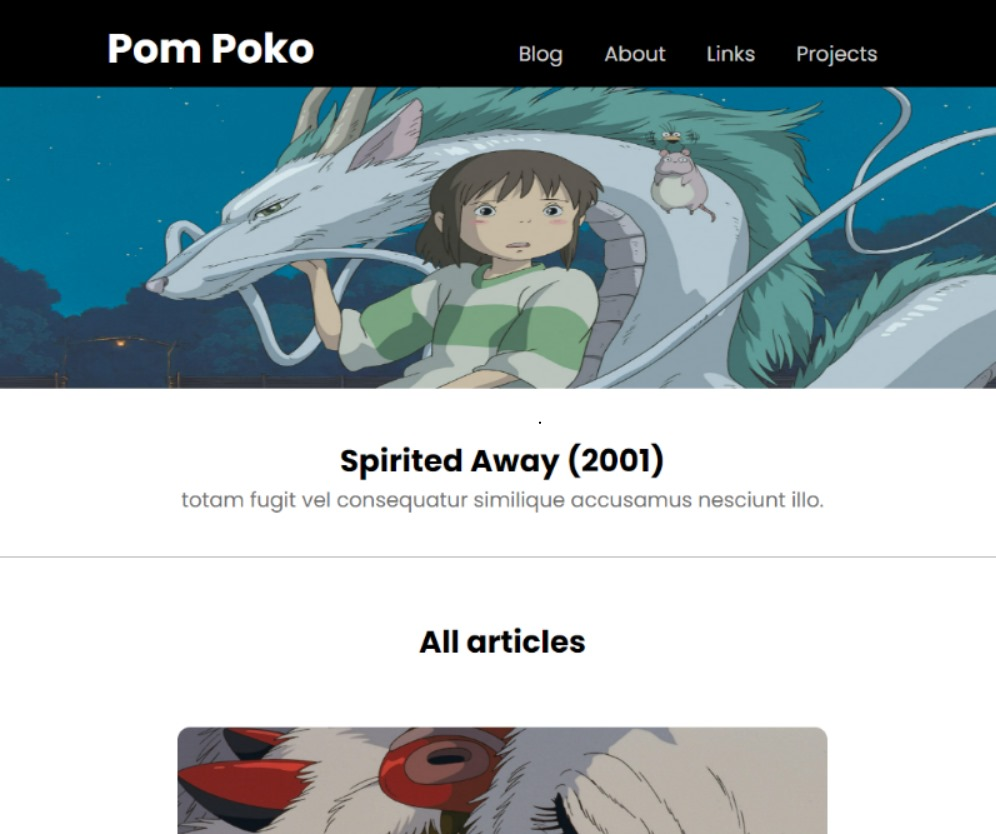

# Compass Uol

>Project built for SP Challenge 01 - Hybrid Mobile Journey (React Native) - AWS Cloud Context

The blog has a home screen with a list of posts, responsive. By clicking on a particular post, you should be directed to a
second screen with the post itself and below a list with their respective
comments

## Technologies

   
   
   
   
   
   
   

